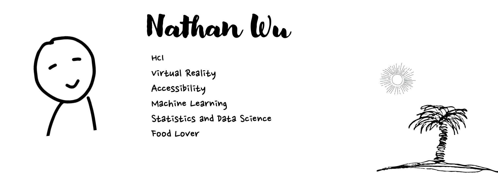

### Hi there 👋
I'm Nathan, a fourth-year student studying __Computer Science__ at UCSB. I am interested in Human and Computer Interaction and Accessibly. During my study at UCSB I have participated in Eearly Research Scholar Program where I studies how Virtual Reality can be used to facilitate peoples’ understanding on Environmental Science data. Checkout our group’s result [here]( https://drive.google.com/file/d/1hlMwbA6lATyMzwldB56foJHeYWUVL4B2/view). Currently, I am a research assistant at [Bionic Vision Lab](https://bionicvisionlab.org/) continuing my study on VR.

| 
:-------------------------:|:-------------------------:

<!--

-->

### I'm listening to 

### Selected Projects :mag: :
| Project  | Tool Used|
| ------------- | ------------- |
| [Time Series Analysis on US Labor Data](https://drive.google.com/file/d/1xUrlsUtG86nmRPjmEMzZo64vhqDjBj9y/view?usp=sharing)  | R, Box-Jekins Mehtod |
<!-- 
| Content Cell  | Content Cell  |
--->

<!--
**NathanWoo/NathanWoo** is a ✨ _special_ ✨ repository because its `README.md` (this file) appears on your GitHub profile.

Here are some ideas to get you started:

- 🔭 I’m currently working on ...
- 🌱 I’m currently learning ...
- 👯 I’m looking to collaborate on ...
- 🤔 I’m looking for help with ...
- 💬 Ask me about ...
- 📫 How to reach me: ...
- 😄 Pronouns: ...
- ⚡ Fun fact: ...
-->
